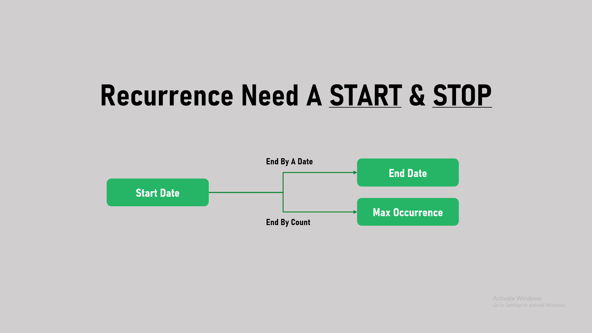
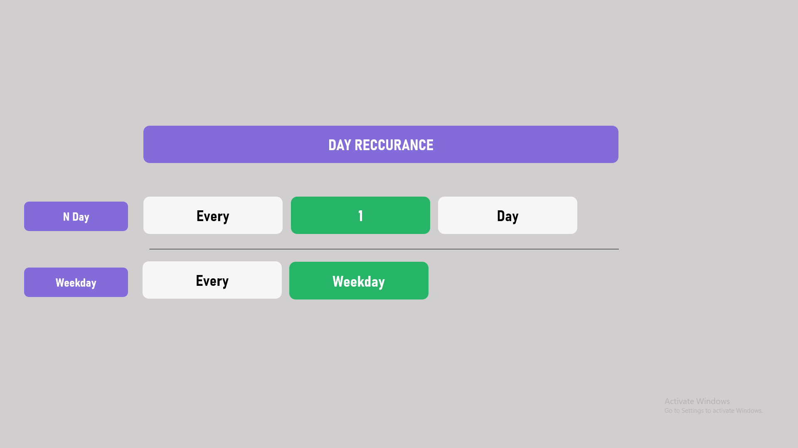
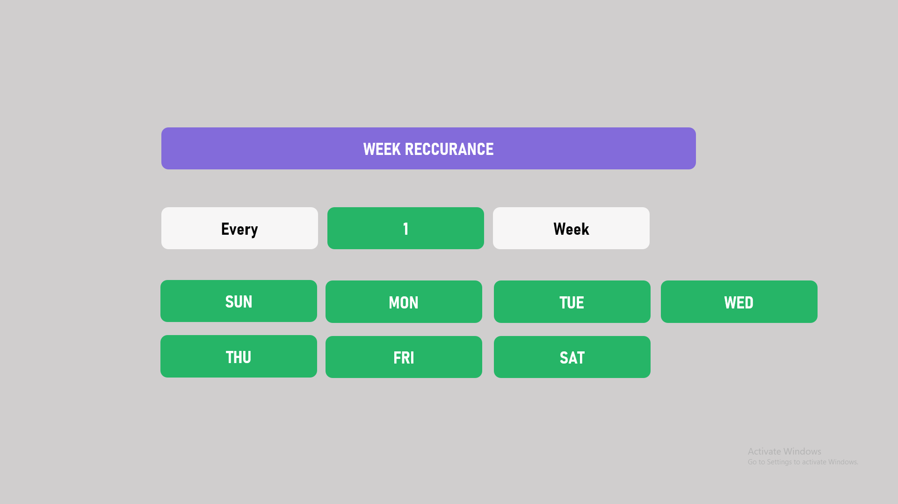
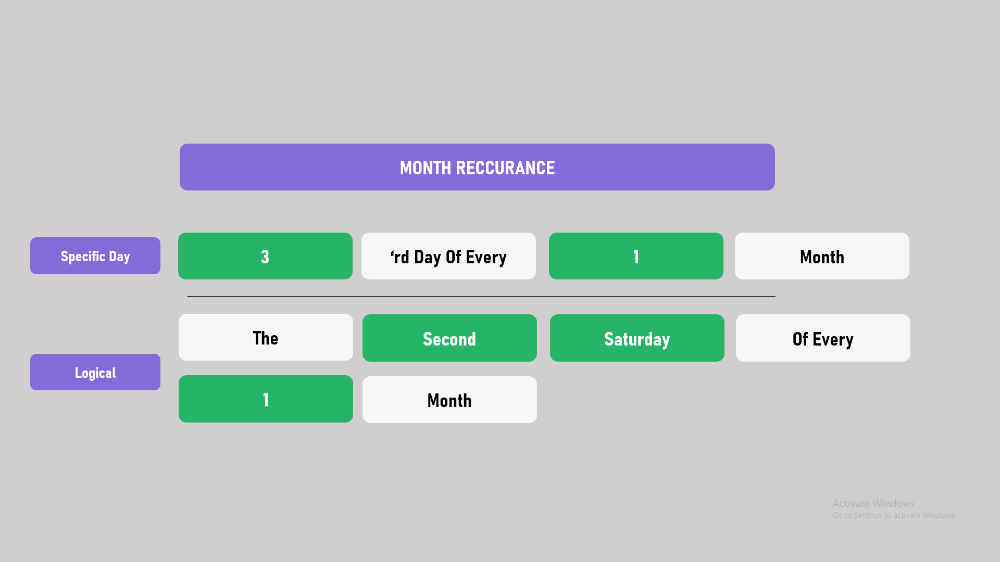
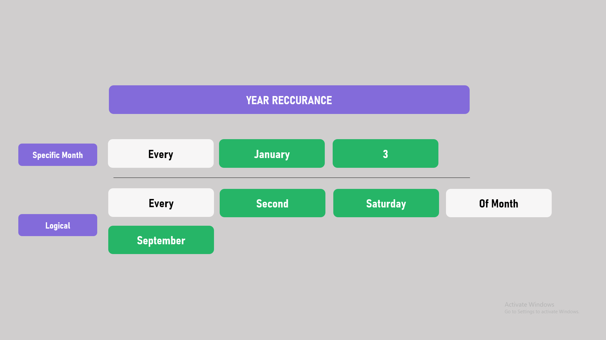

# Express.Reccurence
Express reccurence helps you generate dates based on Reccurance patterns. It is a more simpler wrapper implementation over - https://www.codeproject.com/Articles/20343/Recurring-Date-Generator-with-Pattern-Coding

# Video Deomnstration
How To Use - YouTube : https://www.youtube.com/watch?v=g9aipSsPXm0 

## Generating Reccurences

```
    class Program
    {
        static void Main(string[] args)
        {
            //GLOBALS
            var dates = new List<DateTime>();
            var startDate = DateTime.Now;
            var occurance = 10;

            //BASE PATTERN
            var basePattern = new BasePattern
            {
                StartDate = startDate,
                MaxOccurance = occurance,
                EndMode = ENDMODE.ByOccurance,
            };

            //DAY
            var daySettings = new DayReccurance
            {   
                Constrain = DAYCONSTRAIN.NDay,
                Next = 1
            };
            dates = Reccurance.GenerateDays(basePattern, daySettings).Values;

            //WEEK
            var weekSettings = new WeeklyReccurance
            {
                Next =1,
                Monday=true,
                Wednesday=true,
                Friday=true
            };
            dates = Reccurance.GenerateWeeks(basePattern, weekSettings).Values;

            //MONTH
            var month = new MonthlyReccurance
            {
                Constrain = MONTHCONSTRAIN.Logical,
                LogicalStart = LOGICALSTART.Second,
                LogicalDay = LOGICALDAY.Saturday,
                Next=1
            };
            dates = Reccurance.GenerateMonths(basePattern, month).Values;

            //YEAR
            var yearSettings = new YearlyReccurance
            {
                Constrain = YEARCONSTRAIN.SpecificMonth,
                Next = 1,
                Month = MONTHS.Jan
            };
            dates = Reccurance.GenerateYears(basePattern, yearSettings).Values;
        }
    }
```

# Options Screenshots
### BASIC OPTIONS (Required)

### DAY WISE

### WEEK WISE

### MONTH WISE

### YEAR WISE

